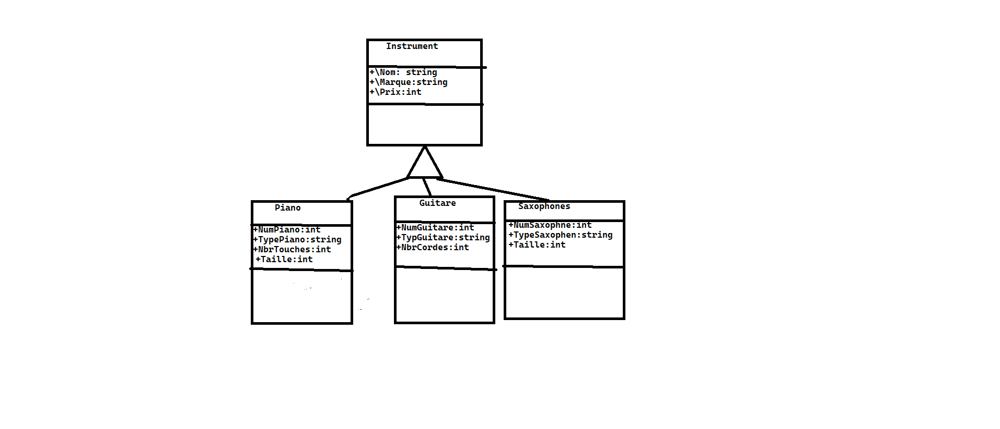

# Labo Finale C#:  Achat de instrument de musique
Mon idée consiste a faire une application de achat de instrument de musique . On peut acheter des instruments soit un piano, guitare ou saxophone, l'utilisateur peut soit ajouter un nouveau instrument modifier les proprités d'un piano par exemple de suprrimé un et acheté

Voci le digramme UML
## UML Modele

## Description de classes
Instrument (classe abstraite)

* Nom : Le nom de l'instrument (type string)
* Marque : La marque de l'instrument (type string)
* Prix : Le prix de l'instrument (type int)
* DateAchat: La date à laquelle il a acheté (type date)

Guitare 
### Cette classe herite de Instrument

* NumGuitar : Le numero de la guitare (type int)
* TypeGuitare : Le type de la guitare si c'est une acoustique ou electrique (type string)
* nbrCordes: le nombre de cordes(type int)

piano
### Cette classe herite de Instrument

* NumPiano : Le numero du piano (type int)
* TypePiano : Le type du piano si c'est un synthé ou un orgue (type string)
* nbrDeTouches: Le nombre de touches (type int)
* Taille: La taille de l'instrument

Saxophone
### Cette classe herite de Instrument

* NumSaxophone : Le numero du Saxophone (type int)
* TypeSaxophone : Le type du Saxophone  (type string)
* Taille: La taille de l'instrument